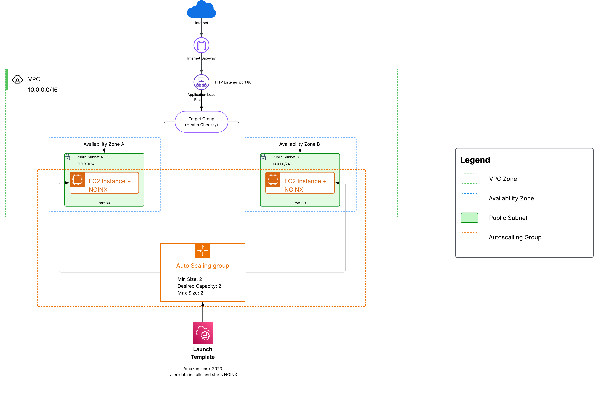

# Auto-Healing Web Tier

This Infrastructure uses Terraform to define an auto-healing NGINX web tier on AWS.
The architecture maintains two EC2 behind an Application Load Balancer. If one instance is terminated 
or becomes unhealthy, the Auto Scaling Group automatically launches a replacement.

### AWS instead of Azure

AWS was selected because EC2 Auto Scaling Groups and Application Load Balancers provide 
more simple way to meet the self-healing requirements.

The solution uses:

- Application Load Balancer
- Auto Scaling Group
- EC2 Launch Template
- Two EC2 with separate Availability Zones
- NGINX installed automatically using user-data

### Architecture

The Application Load Balancer distributes HTTP traffic across two NGINX instances located in separate Availability Zones.

The Auto Scaling Group maintains two instances (desired capacity). 
If one instance fails or terminated, a replacement is automatically created from the Launch Template.

### Steps

1. `terraform init`, Initializes the terraform directory, 
downloads the required AWS provider, and prepares the referenced modules.
2. `terraform fmt -recursive`, Formats all terraform files in the project 
and follow standard formatting rules.
3. `terraform validate`, Validates the terraform configuration to make sure
is valid and consistent.
4. `terraform plan`, Generate and show the infrastructure terraform would create.
   - `terraform plan -out=tfplan`, to saves the generated plan locally.
   - `terraform show -no-color tfplan > terraform-plan.txt`, converts it into a readable text file.

### Assumptions

- VPC CIDR: 10.0.0.0/16 
- Two Availability Zones are used 
- Two EC2 instances provide N+1 capacity for the static web workload
- NGINX as the default static page (port 80)
- Terraform state is stored locally
- Infrastructure deployment is optional

### Estimated Cost

Running terraform plan does not provision the infrastructure and therefore does not accumulate infrastructure runtime cost.

If fully deployed, the design uses two small EC2 instances, one Application Load Balancer and public IPv4 addresses.

The 20 dollars monthly target is achievable when AWS Free Tier usage is considered. 
Standard on-demand pricing may exceed AUD 20 per month, due to the Application Load Balancer and public IPv4 charges.